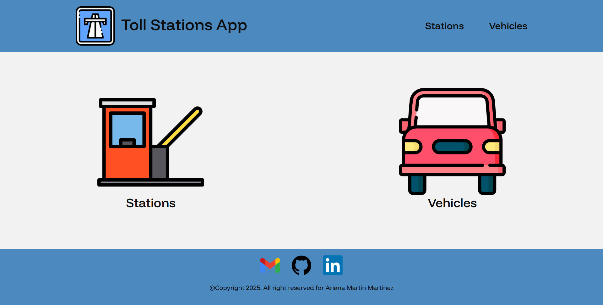
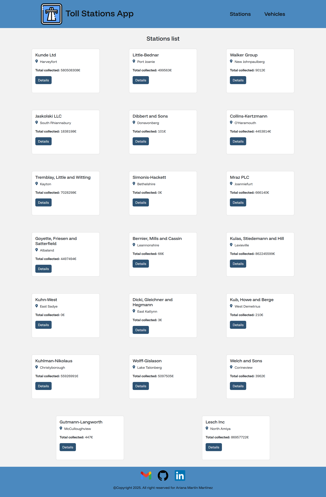
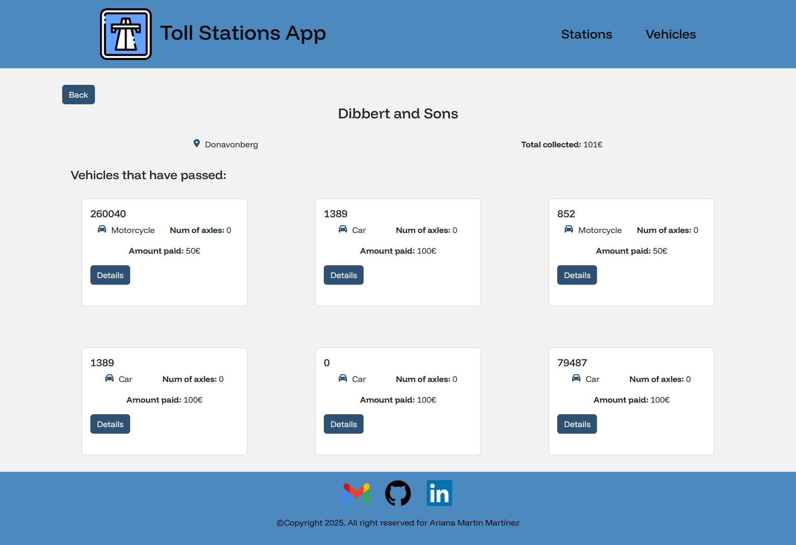
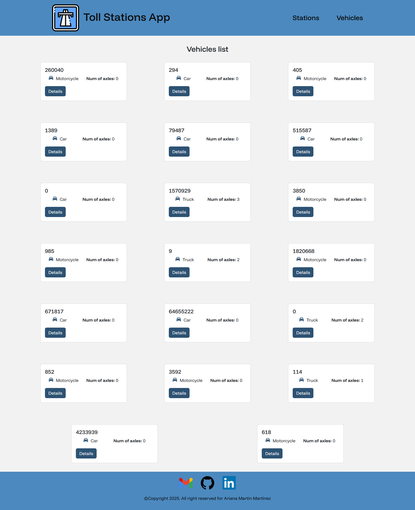
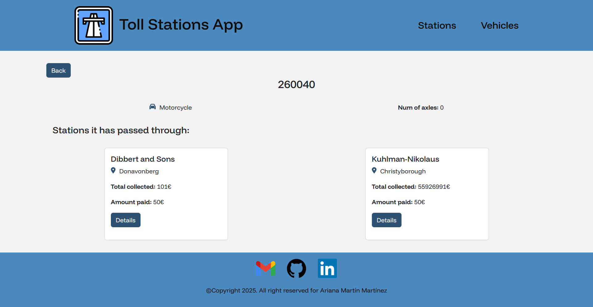
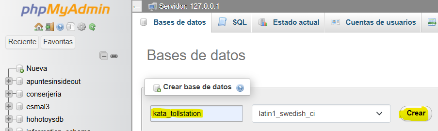
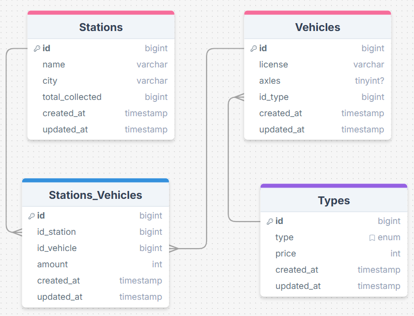
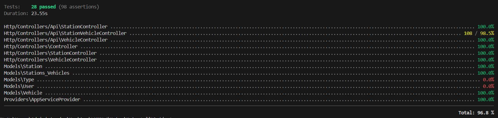

# KATA - Tolls Station

>[!CAUTION]
>Please read all the points of the README in order to make good use of the project. Thank you.

## 💡 Description

This project consists of a website where you can see all the tolls stations and the vehicles that have passed throught them and viceversa.

## 💼 Proyect guide

On the home page we can see two buttons to go to the Stations page or to the Vehicles page.


<p align="center"><em>Home page</em></p>

On the page to see the Stations list we see all the tolls stations and their info.


<p align="center"><em>Stations page</em></p>

If we click the button to see more information about one specific station, we will also see all the vehicles that have passed through that specific station and the amount each one has paid.


<p align="center"><em>Station show page</em></p>

On the page to see the Vehicles list we see all the vehicles and their info.


<p align="center"><em>Vehicles page</em></p>

If we click the button to see more information about one specific vehicle, we will also see all the stations it has passed through that specific vehicle with the amount it has paid.


<p align="center"><em>Vehicle show page</em></p>

## ❓ Installation requierements

In order to run and try this project locally you will need:

1. XAMPP (or any other local server that supports PHP and MySQL)

2. Operating System terminal

3. Install Composer

4. Install NPM via Node.js

5. Xdebug (so you can see the tests coverage)

6. Postman (or any other platform to use the API, like *Insomnia*)

## 💻 Installation

1. Clone the repository:
```
    git clone https://github.com/ArianaMartinMartinez/Kata-TollStation.git
```

2. Install Composer:
```
    composer install
```

3. Install NPM:
```
    npm install
```

4. Create a '.env' file by taking the example '.env.example' file and modify the lines:
    - DB_CONNECTION=mysql
    - DB_DATABASE=kata_tollstation

5. Create a database in MySQL with no tables (I use *phpMyAdmin*)


6. Generate all the tables and fake values:
```
    php artisan migrate:fresh --seed
```

7. Run NPM:
```
    npm run dev
```

8. Run Laravel (in other terminal):
```
    php artisan serve
```

This will generate an url that will lead you to the web similar to this one:
```
    http://127.0.0.1:8000/
```

## 📚 Database diagram

This is the database diagram for this project. We have four tables, **Stations**, **Vehicles**, **Types** and **Stations_Vehicles**.

Stations and Vehicles have a ***ManyToMany*** relation because many vehicles can pass through a station and a vehicle can pass through many stations.

Vehicles and Types have a ***OneToMany*** relation because one vehicle only have one type but a type can belong to many vehicles. A vehicle can be a *car*, *motorcycle* or *truck* and each type has its own price; which is registered in the Types table.



## 🔍 API Endpoints

### Stations

- GET (read all stations)
```
    http://127.0.0.1:8000/api/stations
```

- GET BY ID (read one station selected by ID)
```
    http://127.0.0.1:8000/api/stations/{id}
```

- POST (insert a new station)
```
    http://127.0.0.1:8000/api/stations
```

- PUT (update a station selected by ID)
```
    http://127.0.0.1:8000/api/stations/{id}
```

- DELETE (delete a station selected by ID)
```
    http://127.0.0.1:8000/api/stations/{id}
```

### Vehicles

- GET (read all vehicles)
```
    http://127.0.0.1:8000/api/vehicles
```

- GET BY ID (read one vehicle selected by ID)
```
    http://127.0.0.1:8000/api/vehicles/{id}
```

- POST (create a new vehicle)
```
    http://127.0.0.1:8000/api/vehicles
```

- PUT (update a vehicle selected by ID)
```
    http://127.0.0.1:8000/api/vehicles/{id}
```

- DELETE (delete a vehicle selected by ID)
```
    http://127.0.0.1:8000/api/vehicles/{id}
```

### Tolls

- GET (read all tolls)
```
    http://127.0.0.1:8000/api/tolls
```

- GET BY ID (read one toll selected by ID)
```
    http://127.0.0.1:8000/api/tolls/{id}
```

- POST (create a new toll)
```
    http://127.0.0.1:8000/api/tolls
```

- PUT (update a toll selected by ID)
```
    http://127.0.0.1:8000/api/tolls/{id}
```

- DELETE (delete a toll selected by ID)
```
    http://127.0.0.1:8000/api/tolls/{id}
```

## 👾 Tests

This project has a **96.8%** of test coverage.

You can try the tests and see the coverage in the terminal using:
```
   php artisan test --coverage
```



>[!TIP]
>You can also see the coverage in a web browser using:
>```
>   php artisan test --coverage-html=coverage-report
>```

## 🛠️ Technologies and Tools

<a href='https://github.com/shivamkapasia0' target="_blank"></a>
<a href='https://github.com/shivamkapasia0' target="_blank"></a>
<a href='https://github.com/shivamkapasia0' target="_blank"></a>
<a href='https://github.com/shivamkapasia0' target="_blank"></a>
<a href='https://github.com/shivamkapasia0' target="_blank"></a>
<a href='https://github.com/shivamkapasia0' target="_blank"></a>

<a href='https://github.com/shivamkapasia0' target="_blank"></a>
<a href='https://github.com/shivamkapasia0' target="_blank"></a>
<a href='https://github.com/shivamkapasia0' target="_blank"></a>
<a href='https://github.com/shivamkapasia0' target="_blank"></a>
<a href='https://github.com/shivamkapasia0' target="_blank"></a>

## 👨🏻‍💻 Author

This project was fully developed by: 

[Ariana Martín Martínez](https://github.com/ArianaMartinMartinez)